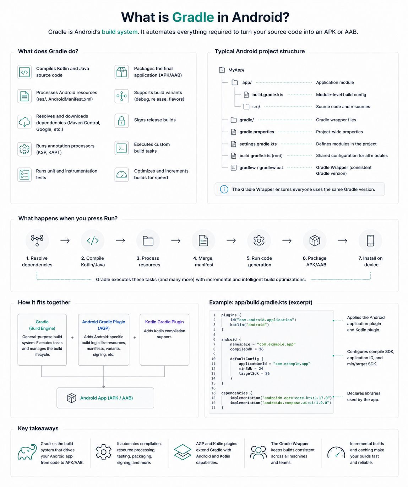
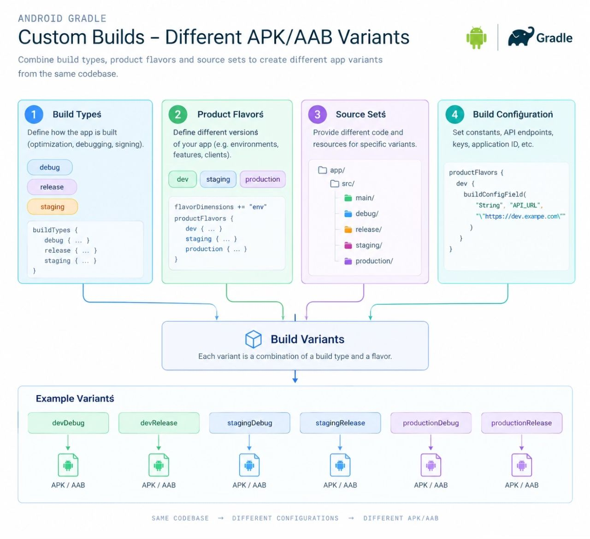

Android Gradle is a powerful build system that automates compiling, testing, packaging, and running your Android applications.   
It transforms source code, resources, and libraries into an executable APK or App Bundle (AAB).    
It runs specific tasks in order, such as compiling Kotlin/Java code, running lint checks, and signing the app.     
It uses the Android Gradle Plugin (AGP) to supply Android-specific build processes.     

Configuring Gradle so the same project can produce different APK/AAB variants from the same source code.

The main mechanisms are.
1. Build types — debug, release, or your own types.

2. Product flavors — different versions of the application, such as free, paid, demo, production.

3. Build variants — combinations of build types and flavors.

4. Source sets — different Kotlin/resources for particular variants.

5. Build configuration — different constants, URLs, API keys, etc.

6. Custom Gradle tasks — automation around the build.    
