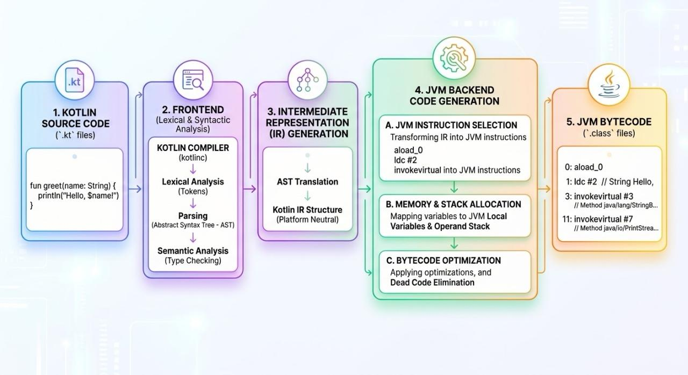

Kotlin to JVM bytecode.

Kotlin source files (⁠.kt⁠) are processed by the Kotlin compiler (⁠kotlinc⁠). The compiler executes a multi-stage pipeline: lexical analysis, parsing into an Abstract Syntax Tree (AST), semantic analysis, and finally, backend code generation. The output is a ⁠.class⁠ file containing JVM bytecode. This bytecode is standard; the Java Virtual Machine cannot distinguish whether the original source was written in Kotlin or Java. This shared target format is the mechanism that enables exact interoperability between the two languages.

In a compiler, the pipeline is generally split into two main phases: a "frontend" and a "backend."

The frontend focuses on understanding the Kotlin language. It reads the code, checks the syntax, verifies the types, and translates it into an Intermediate Representation (IR). The IR is a simplified, platform-neutral blueprint of the program.

The backend code generation takes that IR blueprint and translates it into the final output format. For Kotlin on the JVM, this phase involves.
- Instruction Selection. Converting the IR into specific JVM bytecode instructions (for example, choosing the ⁠iadd⁠ instruction to add two integers).
- Memory Allocation. Deciding how local variables and objects are mapped to the JVM's memory structures.
- Optimization. Tweaking the instructions so the code runs faster or uses less memory, such as removing code that will never be executed.

