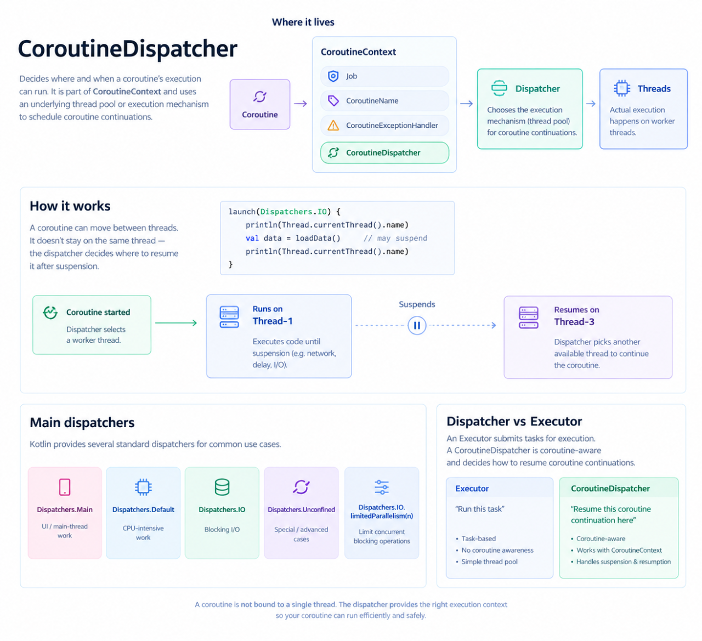

In Kotlin Coroutines, a CoroutineDispatcher determines where and when a coroutine’s execution is allowed to run—more precisely, which execution mechanism/thread pool is used to execute its coroutine continuations.

A coroutine is not permanently attached to one thread. The coroutine can execute on one worker thread, suspend at delay(), and later resume on another appropriate worker thread. 

During suspension, the underlying thread can execute other work. The coroutine itself retains its logical state and later gets resumed by the dispatcher.
