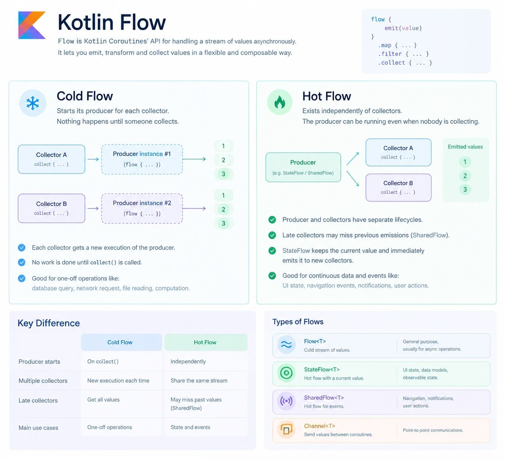

Flow is Kotlin Coroutines’ API for handling a stream of values asynchronously.

Producer — the part that generates and emits values into the Flow.

Collector — the part that receives and processes values emitted by the Flow.

Cold Flow — a Flow whose producer starts executing when a collector starts collecting, with a separate producer execution for each collector.
No collector → no producer execution.

Hot Flow — a Flow whose producer and stream exist independently of collectors. Multiple collectors can observe the same stream, and a collector may miss values emitted before it started collecting.
No collector does not necessarily stop the producer.

