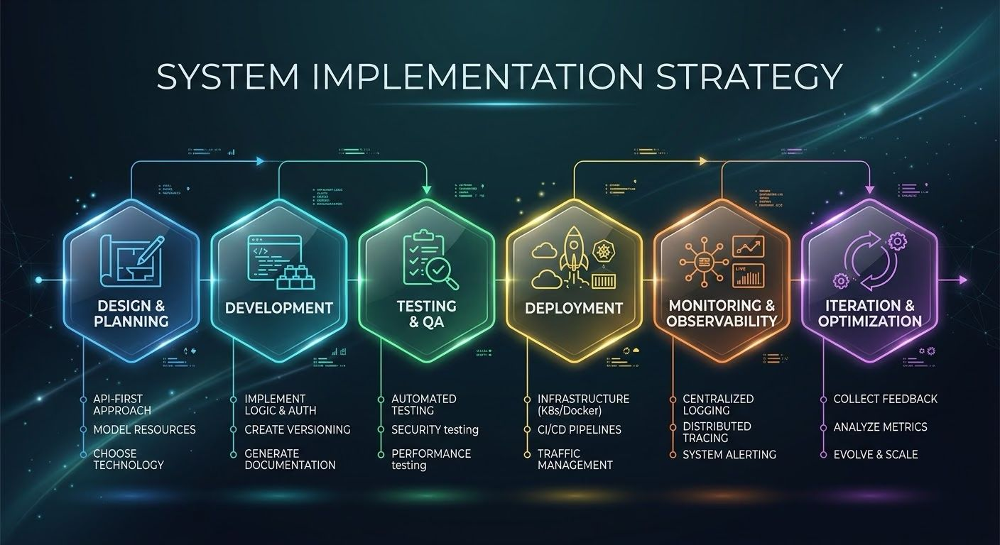

### API Design Best Practices.
1. Resource-Oriented Naming: Use nouns, not verbs. Map endpoints to resources.
- Correct: GET /users, POST /users/{id}/orders
- Incorrect: GET /getUsers, POST /createOrder
2. Semantic HTTP Methods: Map operations strictly to standard methods.
- GET: Retrieve data (read-only, cacheable).
- POST: Create new resources.
- PUT: Replace an entire resource.
- PATCH: Partially update a resource.
- DELETE: Remove a resource.
3. Versioning: Mandate versioning from inception to isolate breaking changes. Inject versioning in the URI (/v1/users) or via Accept headers (Accept: application/vnd.company.v1+json).
4. Pagination, Filtering, and Sorting: Restrict payload sizes for collections. Control data output via query parameters.
- Example: GET /users?status=active&sort=-created_at&limit=50&offset=100
5. Idempotency: Guarantee that executing the same request multiple times leaves the system in the same state as executing it once. Essential for network retries. PUT, PATCH, and DELETE must be idempotent. POST requires idempotency keys.
6. Standardized Error Handling: Output a consistent, predictable error schema. Utilize precise HTTP status codes (200 OK, 201 Created, 400 Bad Request, 401 Unauthorized, 403 Forbidden, 404 Not Found, 429 Too Many Requests, 500 Internal Server Error).
7. Rate Limiting and Throttling: Restrict the number of requests a client can make within a time window to prevent system overload and DDoS attacks.

### API Design Implementation Strategy.
1. Contract-First Development: Define the API structure explicitly before writing application logic. Write specifications using OpenAPI/Swagger for REST or Protobuf for gRPC. Generate client SDKs and server stubs from these definitions.

2. API Gateway Deployment: Route external traffic through a centralized API Gateway (e.g., Kong, AWS API Gateway, NGINX). Offload cross-cutting concerns here, including SSL termination, rate limiting, and request routing.

3. Security Enforcement:
 Enforce TLS (HTTPS) on all endpoints.
 Implement stateless authentication using JWT (JSON Web Tokens) or OAuth 2.0.
 Validate authorization scopes before processing resource-level logic.

4. Telemetry and Tracing: Inject correlation IDs (e.g., ⁠X-Request-ID⁠) at the gateway. Propagate these IDs through all downstream microservices. Aggregate logs centrally for operational visibility.

5. Load Balancing: Deploy backend services redundantly behind a load balancer to distribute traffic, enabling horizontal scaling and high availability.
