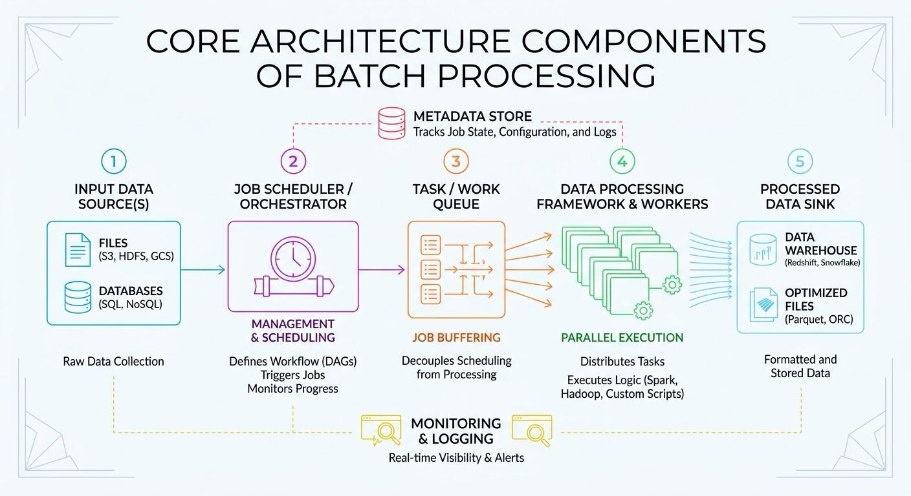

In System Design Batch processing systems execute high-volume, repetitive data jobs without manual intervention.

Core Architecture Components
1. Job Scheduler: Orchestrates the execution of batch jobs based on time triggers (cron) or dependency completion (DAGs). Tools include Apache Airflow or Kubernetes CronJobs.
2. Task Queue: Decouples task submission from execution. Holds pending jobs. Tools include AWS SQS or RabbitMQ.
3. Worker Nodes: Distributed compute instances that pull tasks from the queue, process the payload, and write the output. They scale horizontally based on queue depth.
4. Metadata Store: A database tracking job status (pending, running, failed, completed), retry counts, and execution logs.
5. Data Storage: The source and destination for the processed data, such as a Data Lake or AWS S3.

Batch processing is essential in industries that handle massive volumes of data where immediate, real-time results aren't strictly necessary.

Architectural advantages.
- Prevents compute and memory exhaustion for real-time, user-facing applications.

- Maximizes existing hardware utilization during low-traffic periods.

- Reduces infrastructure costs by shifting compute-intensive tasks to off-peak pricing windows.
