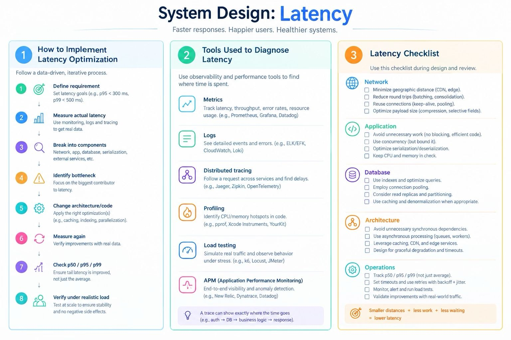

Latency is the amount of time between an action starting and the corresponding result becoming available.

Latency is primarily a user-experience and system-responsiveness property.

Actual latency is how long the operation really takes.

Perceived latency is how long the user has to wait before the application feels responsive.

Caching, optimistic UI, prefetching and asynchronous processing can improve perceived latency even when the underlying computation hasn’t become fundamentally faster.

That distinction is especially important in mobile system design.

    