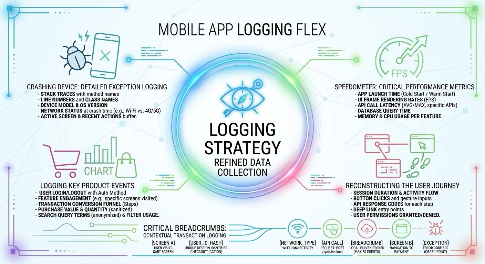

Capturing the right telemetry data to give clear visibility into app performance, user experience, and stability without creating unnecessary noise or overhead.

Crash Reports & Errors.
Unhandled exceptions, stack traces, and fatal app crashes allow fix critical bug and maintaining overall app stability.

Performance Metrics.
App launch time, frame rates (FPS), network latency, and memory/CPU usage. Ensuring a smooth, responsive user interface.

State & Navigation Logs.
Screen transitions, UI state changes, and key background task lifecycle events. Reconstructing the timeline leading up to an issue.

Business & Product Events.
Critical user actions (e.g., ⁠item_added_to_cart⁠, ⁠checkout_completed⁠) bring understanding feature adoption and core user journeys.

