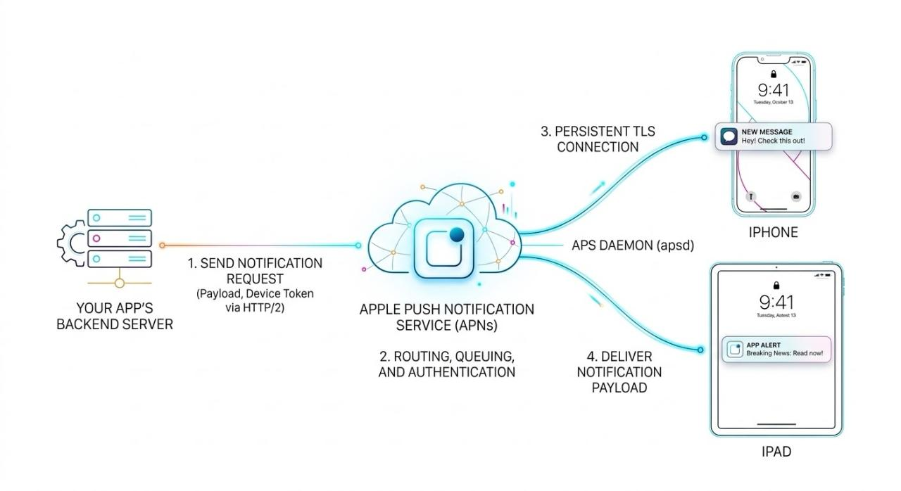

The core of the Apple Push Notification service (APNs) relies on a single, long-lived connection rather than constant polling. 

When an Apple device boots up or connects to a network, a background iOS system daemon called apsd (Apple Push Services Daemon) initiates an outbound, encrypted TLS/TCP connection to Apple's servers, typically over port 5223.  

Because the device initiates the outbound connection, the internet service provider (ISP) or cellular network creates a Network Address Translation (NAT) mapping. This mapping dictates how return traffic from APNs reaches the device, even though mobile devices sit behind carrier firewalls and do not have static public IP addresses.

When a device moves between cell towers on the same carrier network, its IP address remains constant. The cellular carrier's core network handles the tower handoff at the radio layer. Because the device IP and APNs IP do not change, the existing TCP socket to Apple remains open. No reconnection is required.

If the device moves outside city coverage into a dead zone or roams to a different carrier, the network drops or the IP address changes. The cellular baseband processor instantly notifies the OS of the state change. The Apple Push Services Daemon (⁠apsd⁠) identifies the broken socket.

Once the device regains a signal and the carrier assigns a new IP address, ⁠apsd⁠ immediately initiates a new outbound TLS/TCP connection to APNs.

Switching between Wi-Fi and cellular fundamentally changes the device's IP address, unlike moving between cell towers.

The iOS operating system continuously monitors network interfaces. When your device connects to a Wi-Fi network, the OS assigns a new local IP address and changes the primary routing path. It instantly notifies the ⁠apsd⁠ daemon of this network state change.

Here is the sequence that follows:
1. ⁠apsd⁠ immediately initiates a brand new TLS/TCP connection to APNs over the new Wi-Fi interface.
2. The device authenticates this new connection with Apple using its unique device certificate.
3. Apple's servers update their internal routing table, mapping your device token to this new socket.
4. The old cellular connection is gracefully closed to conserve battery.
When leaving Wi-Fi, the exact reverse happens: the OS detects the Wi-Fi drop, promotes the cellular radio to primary, and ⁠apsd⁠ immediately builds a new socket over the cellular network.
        