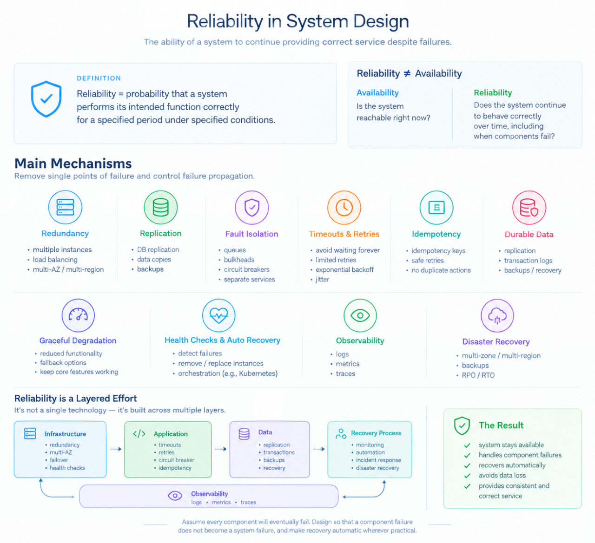

Reliability is ensuring that a system performs its intended function correctly for a specified period under specified conditions.

The main mechanisms.
Reliability is usually achieved by removing or containing single points of failure and controlling failure propagation.

1. Redundancy
Don’t depend on a single instance.

2. Replication
Maintain multiple copies of important resources.

3. Fault isolation
One failure shouldn’t bring down unrelated parts of the system.

4. Timeouts
Never wait indefinitely for another component.

5. Retries
Transient failures can sometimes be recovered by retrying.

6. Idempotency
Retries create an important problem. The server remembers that abc123 has already been processed and doesn’t execute the operation twice.

7. Durable data
For important data, reliability requires protecting against data loss.

8. Graceful degradation
A reliable system doesn’t necessarily provide 100% functionality during every failure.

9. Health checks and automatic recovery
The system needs to detect failures and recover.

10. Observability
You cannot reliably operate a system that you cannot observe.

11. Disaster recovery
Reliability also considers failures larger than a single server.
