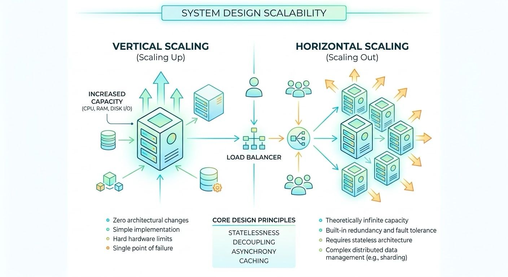

Scalability is a system's capacity to handle increased load without performance degradation by adding resources. It is not equivalent to performance; performance measures speed at a specific load, whereas scalability measures the ability to maintain speed as load increases.

Vertical Scaling (Scaling Up)
Increasing the capacity of a single physical or virtual machine by adding CPU, RAM, or disk I/O.
- Advantage: Zero architectural changes required. Simple implementation.
- Limitation: Hard physical hardware limits. Introduces single points of failure. Often requires downtime during resource allocation.

Horizontal Scaling (Scaling Out)
Adding additional machines or nodes to a resource pool to distribute the load across a cluster.
- Advantage: Theoretically infinite capacity limits. Built-in redundancy and fault tolerance.
- Limitation: Requires stateless application architecture, load balancing, and complex distributed data management architectures such as sharding and replication.

Core Design Principles for Scalability
- Statelessness
- Decoupling
- Asynchrony
- Caching

   