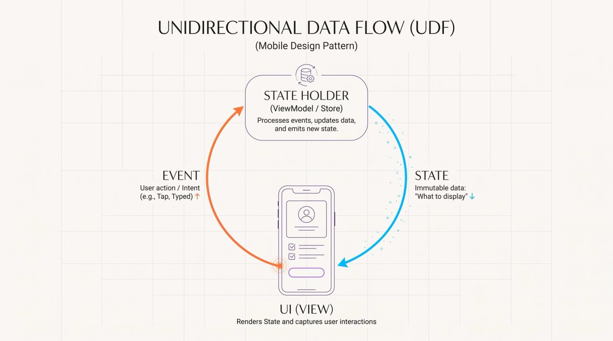

## Unidirectional Data Flow (UDF) separates UI rendering from state mutation.    
## The core principle: state flows down, events flow up.

### 1. State (Data)
- Definition: An immutable, read-only data structure representing the exact configuration of the UI at a specific moment.
- Function: Dictates what the UI must display. Because it is immutable, it cannot be altered directly by the UI.

### 2. UI (View)
- Definition: The visual components (e.g., Jetpack Compose, SwiftUI, XML).
- Function: Passively observes the State and renders it. Captures user interactions and converts them into Events.

### 3. Event (Action/Intent)
- Definition: A signal indicating an occurrence (e.g., "LoginButtonClicked", "SwipeToRefresh").
- Function: Transmits user intent or system triggers from the UI upward to the State Holder.

### 4. State Holder (ViewModel/Store)
- Definition: The component responsible for business logic and state management.
- Function: Receives Events from the UI. Executes necessary logic (network calls, database queries). Constructs a new State object reflecting the outcome. Exposes the new State downward to the UI.

### The Cycle:
### UI emits Event → State Holder processes Event → State Holder emits new State → UI renders new State.

