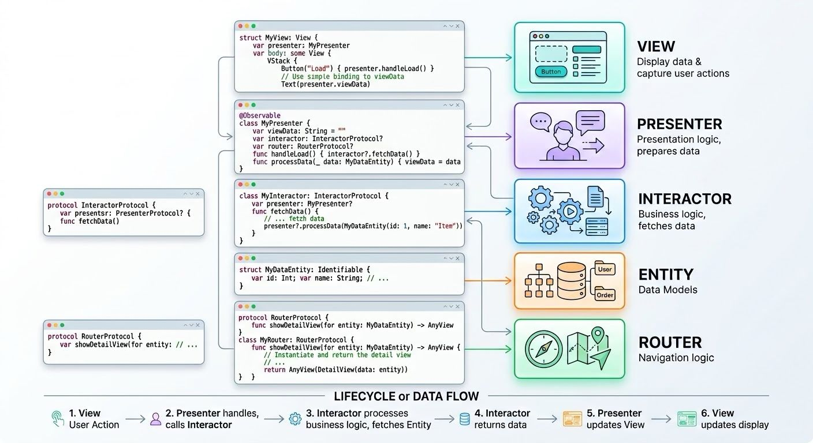

The VIPER architecture pattern is a clean, modular design pattern that breaks code into five distinct components with single, clear responsibilities. While it originated in UIKit, adapting VIPER for SwiftUI leverages SwiftUI's state-driven UI system.

Components.
1. V - View: The SwiftUI View (⁠struct View⁠). It displays the UI and sends user actions (like button taps) to the Presenter. It listens to the Presenter's state to update itself.
2. I - Interactor: Contains the pure business logic (fetching data from a network/database, manipulating data models). It knows nothing about the UI.

3. P - Presenter: The central mediator (conforms to ⁠ObservableObject/Observable macro⁠). It takes raw data from the Interactor, formats it into displayable data for the View, and handles presentation logic.

4. E - Entity: Pure data models (like ⁠struct Book⁠).

5. R - Router / Wireframe: Handles navigation logic (e.g., presenting a new view or managing ⁠NavigationPath⁠).

