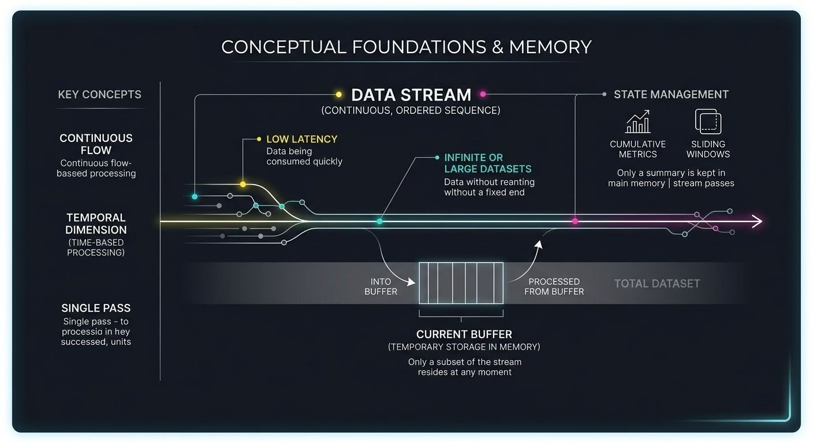

A data stream is a continuous, ordered sequence of data items that are transferred and processed over time, rather than loaded into memory all at once.

Buffers and Backpressure.
Because data sources (like network connections or slow hard drives) send data at unpredictable speeds, streams rely on a buffer—a small temporary block of RAM that holds incoming chunks before your program processes them.
- Producer: The source generating data (e.g., a network socket downloading a video).
- Consumer: The code processing data (e.g., a video player rendering frames).

When the Producer sends data much faster than the Consumer can process it, the buffer fills up. To avoid overflowing memory, the system uses Backpressure a feedback signal sent back to the producer.

