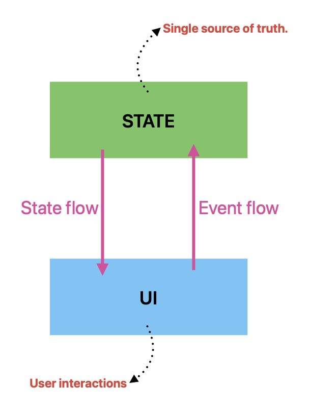
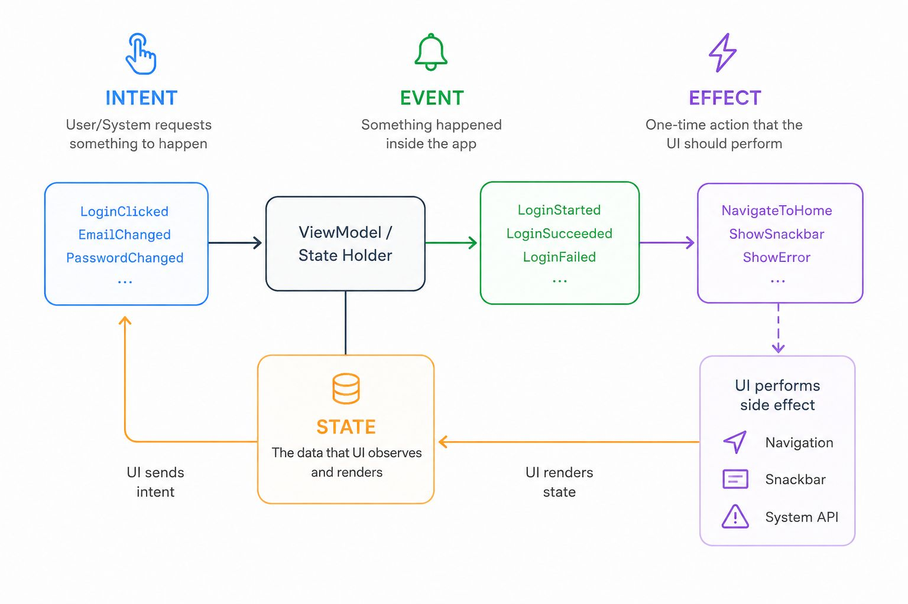

# Unidirectional Data Flow (UDF)

A design pattern where UI state flows downward from a state holder to the screen, and user events flow upward to update that state. It enforces a single source of truth, making mobile app state highly predictable, testable, and consistent.

* **Single Source of Truth:** Data only lives in one designated place. Avoid the messy synchronization bugs common with scattered, multi-source states.
* **Decouplee Components:** The UI only renders what it is given. It does not modify data directly, making views lightweight and strictly focused on visuals.
* **Enhanced Testability:** Because the state holder and business logic are separated from the visual framework, it is much easier to write pure unit tests.

## Best Practices & Pitfalls
* **Immutable States:** Never allow the UI to mutate the state object directly; always require updates to go through the official event pipeline.
* **Manage Side Effects:** Isolate network requests and database calls from your UI state updates to keep the data flow strictly one-way.

## Intent -> Event -> Effect
1. Intent (The Action)An Intent represents the driver of change. 
In UDF architectures, the View emits Intents to the ViewModel to signal that the user did something or that the screen has loaded.Note: This is distinct from the Android framework android.content.Intent (used for starting Activities), though the conceptual philosophy of "signaling intention" is similar.Punchy Fragment: User clicks a "Delete" button → Intent.DeleteUser(id).

2. Event (The State Changer)An Event is something that happens in the system. 
It usually acts as the bridge between an asynchronous operation (like a network call) and a state update.Punchy Fragment: Database finish processing → Event.UserDeletedSuccessfully.

3. Effect (The Side Effect)An Effect is a transient UI event. 
Unlike standard UI state (which stays on the screen when you rotate the device), an Effect happens exactly once and should not be persisted.Punchy Fragment: Showing a confirmation popup → Effect.ShowToast("User Deleted").

  

[iOS example](../../iOS/UDF)