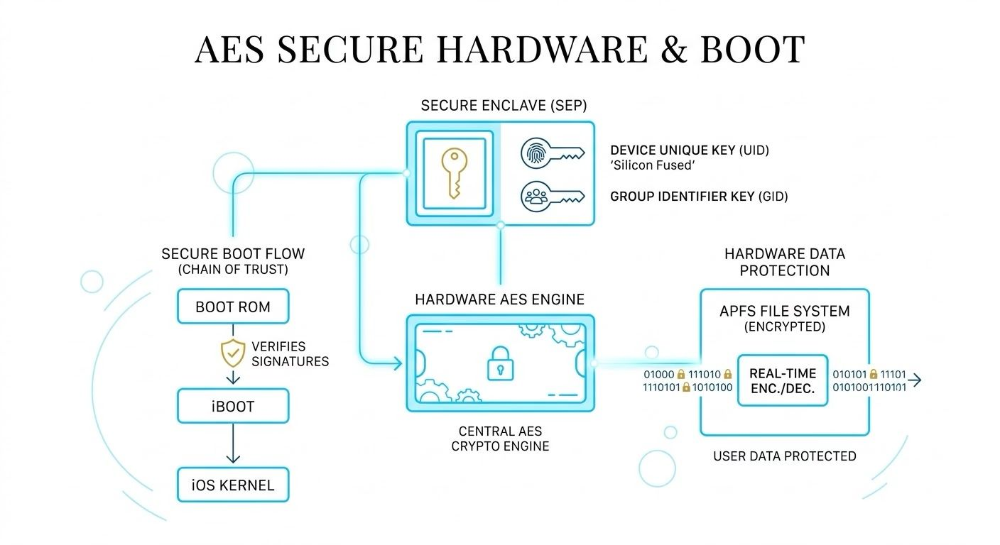

On iOS, AES (Advanced Encryption Standard) is supported hardware-level via dedicated crypto engines embedded in Apple Silicon Secure Enclave / AES engine.

The AES engine plays a fundamental hardware role in establishing the Root of Trust 🛡️ and maintaining the Chain of Trust during the iOS boot sequence.
When an iOS device turns on, it executes a carefully orchestrated sequence where every piece of software is cryptographically verified before it is allowed to run.

1. Secure Enclave Processor (SEP) Key Isolation.
The AES engine works alongside the Secure Enclave—a dedicated hardware coprocessor. The AES hardware key (UID) is burned directly into the silicon during manufacturing. Not even the iOS kernel or high-level processors can read this key; the AES engine uses it directly to decrypt sensitive boot components and user data.

 2. Hardware Boot ROM Verification.
The very first code executed is the Boot ROM (Read-Only Memory), which is permanently etched into the chip. The hardware AES engine helps rapidly verify the digital signatures (using SHA/RSA or ECC alongside AES mechanisms) of the next stage bootloader (iBoot) before loading it into memory.

 3. Encrypted File System Protection (APFS).
iOS uses AES-XTS mode at the hardware level to transparently encrypt the storage volume. During boot, once user credentials or device keys are validated by the Secure Enclave, the AES engine handles real-time decryption of the operating system binaries and data volume.

