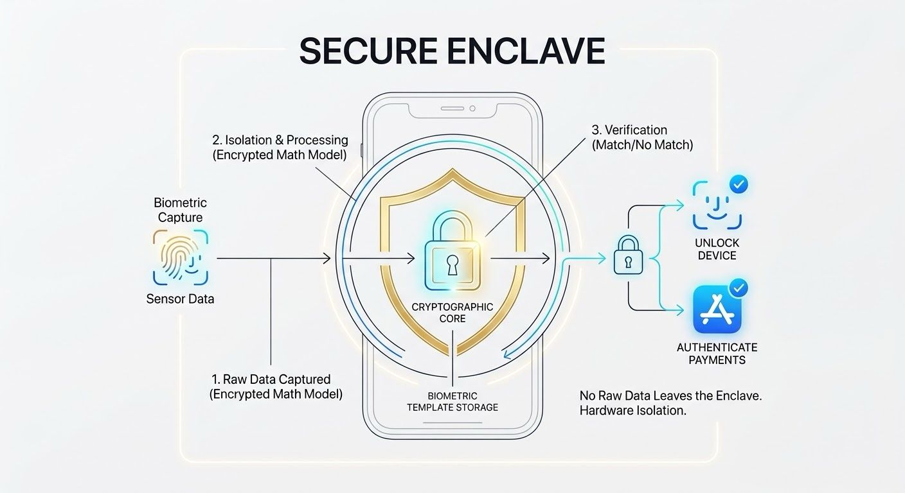

The Secure Enclave is a dedicated hardware coprocessor isolated from the main application processor in Apple devices. It acts as an isolated security vault designed to process sensitive cryptographic tasks and biometric authentication (Face ID and Touch ID) without exposing raw data to the primary operating system or third-party apps. 

Key Responsibilities
1. Biometric Isolation: Converts raw biometric sensor scans into encrypted mathematical representations (templates). Your actual photo or fingerprint image is never saved or accessible.

2. Cryptographic Key Management: Holds system-level encryption keys (such as Data Protection keys and Keychain access keys). Keys never leave the Secure Enclave.

3. Hardware Anti-Replay & Rate Limiting: Enforces delays after repeated failed biometric attempts to prevent brute-force attacks.

