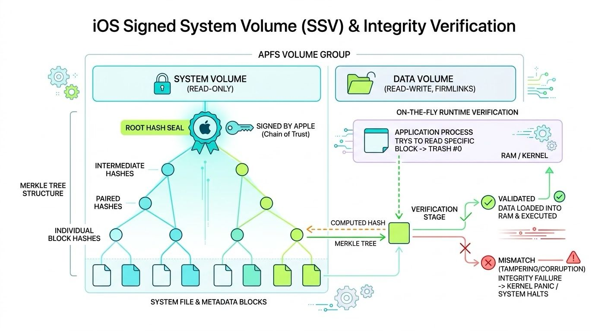

Signed System Volume (SSV)
The Signed System Volume (SSV) is a security architecture built into the Apple File System (APFS). It mathematically guarantees that the operating system on disk is exactly as Apple released it, preventing offline tampering, persistent malware, and file corruption.

Architecture and Mechanics
1. APFS Volume Group Separation
iOS splits storage into two distinct APFS volumes that appear as a single unified filesystem via "firmlinks" (bi-directional aliases):
 System Volume: Contains the OS and built-in apps. Mounted strictly read-only.
 Data Volume: Contains user data, settings, and third-party apps. Mounted read-write.

2. Merkle Tree Construction
Every data block and metadata structure on the System Volume is hashed. These hashes are paired and hashed again, propagating up through a hierarchical tree structure known as a Merkle tree.

3. The Cryptographic Seal
The single root hash at the very top of the Merkle tree is the "seal." During an OS installation or update, this seal is cryptographically signed by Apple's servers using private keys. The signed seal is stored on the device.

4. Boot Chain Validation
When the device powers on, the Secure Boot chain (from the Boot ROM to iBoot) loads the signed seal. It verifies Apple's cryptographic signature. If the signature is missing or invalid, the device refuses to boot.

5. On-the-Fly Runtime Verification
SSV enforces integrity at runtime. It does not scan the entire disk at boot. Instead, when the OS attempts to read a specific block of data from the System Volume into memory, APFS calculates the hash of that block in real-time. It compares this calculation against the trusted Merkle tree hash. If the hashes do not match (indicating the file was modified), the kernel immediately panics and halts the system to prevent compromised code from executing.

6. The Snapshot Update Process
Because the System Volume is sealed and read-only, it cannot be modified live. OS updates use APFS snapshots:
1. The system creates a clone of the current System Volume snapshot.
2. The clone is mounted read-write in the background.
3. Update payloads are applied to the clone.
4. A new Merkle tree is calculated for the updated clone.
5. The device requests a new cryptographic signature from Apple for the new seal.
6. The system locks the new snapshot as read-only, applies the seal, and designates it as the new boot volume.
7. The device reboots into the updated, securely sealed snapshot

