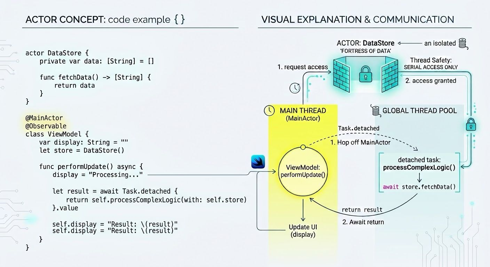

In Swift, an actor is a reference type (like a ⁠class⁠) that protects its internal state from data races. It ensures that only one task can access its mutable state at any given time. Because access is isolated, reading or modifying an actor's state from the outside requires asynchronous calls using ⁠await⁠.

The simplest way to communicate is to start a detached task from a ⁠@MainActor⁠ context, perform background work, and return the result using ⁠await⁠.

If detached task needs to report progress or trigger multiple UI updates over time, explicitly target the ⁠@MainActor⁠ from inside the detached closure using ⁠MainActor.run⁠ or by calling a ⁠@MainActor⁠-isolated method.

