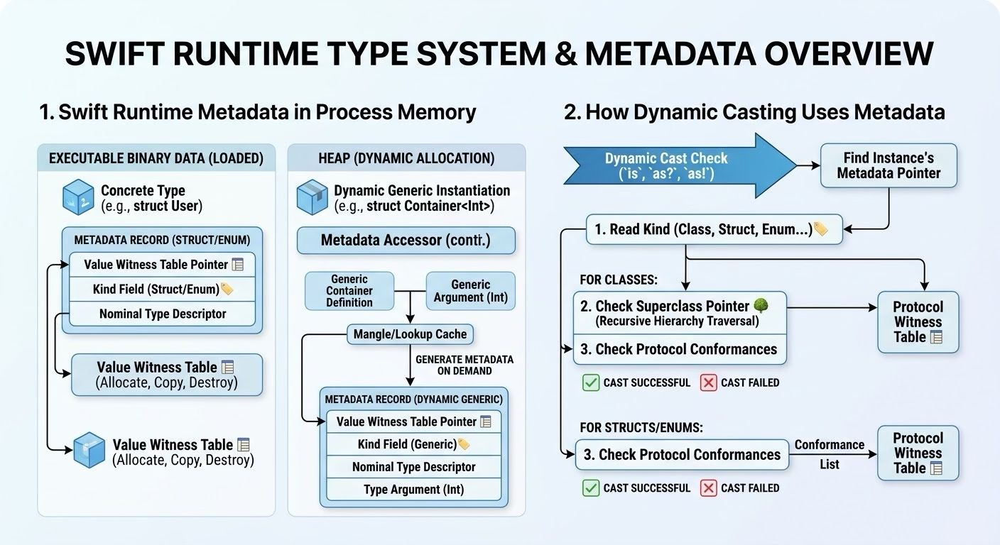

In Swift, every type has a corresponding metadata record in memory. When the runtime needs to inspect a type on the fly, it looks at a pointer to this record.

All metadata records share a common base structure that includes two vital pieces of information. 

1. Value Witness Table Pointer: This points to a table of specialized functions. These functions tell the runtime how to allocate, copy, and destroy instances of that specific type in memory.

2. Kind Field: This tells the runtime exactly what category of type it is looking at (e.g., a Class, Struct, Enum, Tuple, etc.).

Once the runtime reads the ⁠Kind⁠ field, it knows how to read the rest of the metadata record. For example, the metadata layout for a ⁠struct⁠ is relatively simple, while the layout for a ⁠class⁠ is larger and includes additional information, such as a pointer to its superclass.

Also runtime uses this exact piece of memory to:
- Figure out the memory offsets of a struct's properties so it knows exactly where to read or write data.

- Enable reflection (like when you use ⁠Mirror⁠ in Swift to print out all properties of an object).

-Validate type conversions.

